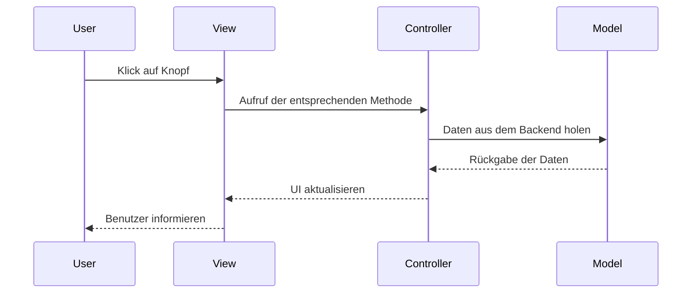

# M133 - Model-View-Controller

MVC ist ein **Design-Pattern**, welches die Strukturierung von Anwendungen erleichtert. Es ist ein Ansatz, um die verschiedenen Komponenten einer Anwendung zu trennen. Das Ziel von MVC ist es, die einzelnen Komponenten des Programms voneinander zu **trennen**. Dadurch ist es möglich, dass die einzelnen Komponenten **unabhängig** voneinander entwickelt werden können. Es ist möglich, dass die View von einem anderen Programm verwendet wird, ohne dass das Model oder der Controller verwendet werden. Das Model kann auch von einem anderen Programm verwendet werden, ohne dass die View oder der Controller verwendet werden.

## Aufbau von MVC

Als **Einsteigspunkt** gilt bei MVC der Controller. Dieser ist für die Verarbeitung der Anfragen zuständig. Er ruft die entsprechenden Model-Methoden auf und gibt die Daten an die View weiter. Die View ist für die Darstellung der Daten zuständig. Sie ruft die entsprechenden Controller-Methoden auf, wenn der Benutzer auf einen Button klickt.

### Model

Das Model ist die **Datenhaltung**. Hier werden die Daten gespeichert und verarbeitet. Es ist unabhängig von der View und dem Controller. Bei richtigem Design ist es möglich, dass das Model auch von anderen Programmen verwendet werden kann, ohne die View oder den Controller zu verwenden.

### View

Die View ist die **Benutzeroberfläche**. Hier werden die Daten angezeigt und der Benutzer kann mit dem Programm interagieren.

### Controller

Der Controller ist die Verbindung zwischen Model und View. Er verarbeitet die **Benutzereingaben** und gibt diese an das Model weiter. Er holt sich die Daten aus dem Model und gibt sie an die View weiter.

## Beispiel

Das folgende Beispiel zeigt, wie ein einfaches **MVC-Programm** aufgebaut ist. Personen werden aus der Datenbank geholt und in einer Tabelle angezeigt. Über ein Suchfeld kann nach Personen gesucht werden. Das Projekt beinhaltet auch ein Beispiel wie der Code nicht aufgebaut sein sollte.

## Container

Es beinhaltet die Docker-Container:

-   php
-   mysql
-   adminier

### Container : php

-   Dockerfile im Verzeichnis php
-   TCP-Port 8000
-   Das Verzeichnis app wird in den Container als Webroot gemountet

### Container : mysql

-   Basierend auf Mysql 5.7
-   TCP-Port 3306
-   Login: user/userpass
-   Das Verzeichnis mysql/mysqldata wird als Datenspeicher in den Container gemountet

### Container : adminier

-   Alternatives Phpmyadmin
-   TCP Port 8080
