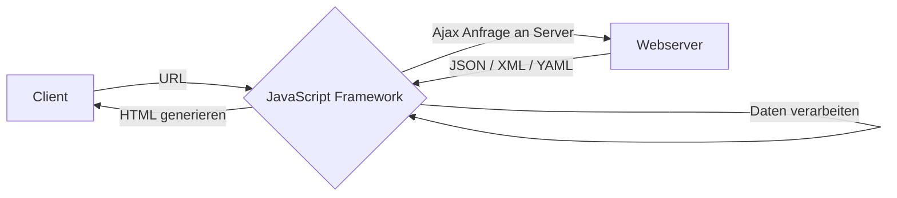

---
tags:
    - "Nicht zugeteilt"
---

# Rendering

In der Vergangenheit gab es immer wieder extreme **Entwicklungen** im Bereich Rendering. Zuerst wurde alles **Server-Side** gerendert, bis man auf die Idee gekommen ist, dass der Client alles über **Client-Side** laden könnte. Mittlerweile haben sich diese Extreme etwas gefangen und man versucht das Beste aus [beiden Welten](https://arkwright.github.io/images/scaling-react-server-side-rendering/ssr-csr.svg) zu nehmen. Die erste Anfrage wird Serverseitig gerendert. In der Applikation wird dann die **Navigation** Clientseitig betätigt. So bekommt man die Vorteile vom schnellen Laden und die angenehme Steuerung. Es gibt noch weitere Methoden wie **Pre-Render** Seiten, wobei die Dateien zuvor als statisches HTML generieren. Wenn eine Anfrage kommt, dann wird ohne Bearbeitung oder Interpretation die Seite zurückgegeben. Dies ist für dynamische Werte nicht möglich, da diese erst zur **Laufzeit** berechnet werden können. Beide folgenden Kapitel wurden aus einer externen der [Webseite](https://www.toptal.com/front-end/client-side-vs-server-side-pre-rendering) entnommen.

## Diagramm

Das folgende Diagramm zeigt den **Ablauf** einer Client-Side-Rendering Anwendung:

## Client Side Rendering

Clientseitiges Rendering ermöglicht es Entwicklern, ihre Websites mit **JavaScript** vollständig im Browser zu laden. Anstatt für jede URL eine eigene HTML-Seite zu haben, wird bei einer clientseitig gerenderten Website jede Route **dynamisch** direkt im Browser erstellt. Dieser Ansatz verbreitete sich, als die JS-Frameworks ihn leicht anwendbar machten. Wenn CSR von Hand gemacht wird, dann wird meistens [Ajax](https://www.w3schools.com/xml/ajax_intro.asp) verwendet.

## Server Side Rendering

Eine Webseite direkt auf dem Server mit **benutzerdefinierten** Daten auszufüllen, ermöglicht das serverseitige Rendering. Es ist in der Regel schneller, alle Anfragen innerhalb eines Servers zu stellen, als zusätzliche **Browser-zu-Server-Rundreisen** für sie zu machen. Dies war die Vorgehensweise der Entwickler vor dem clientseitigen Rendering.

## Fazit

-   Da CSR den Inhalt der Seite erst nach dem Laden anzeigt ist die `Time to First Byte` (TTFB) bei besser. Jedoch ist die `Time to First Meaningful Paint` (TTMFP) bei SSR besser, da der Inhalt der Seite schneller angezeigt wird.
-   SEO ist bei SSR besser, da der HTML Code bereits vorher geladen wurde und somit auch von **Suchmaschinen** gescannt werden kann. Bei CSR wird der HTML Code erst nachgeladen und somit nicht von Suchmaschinen gescannt.
-   Das clientseitige Rendering verwaltet das Routing dynamisch, ohne die Seite jedes Mal zu aktualisieren, wenn ein Benutzer eine andere Route anfordert.
-   Das serverseitige Rendering ist in der Lage, beim ersten Laden einer beliebigen Route der Website eine **vollständig** ausgefüllte Seite anzuzeigen, während beim clientseitigen Rendering zunächst eine **leere Seite** angezeigt wird.

## Beispielprojekt

Zur **Veranschaulichung** einer CSR-Webseite mittels PHP wurde ein Projekt erstellt. Als Vorlage galt der ÜK 307, in welchem bereits eine Grundstruktur dafür erstellt wurde. Aus dem neu gelernten Wissen aus diesem Modul wurde diese Struktur erweitert. Die Webseite stellt eine Liste von Kunden dar. Über einen **Hinzufügen**-Knopf kann ein neuer Kunde in die **SQLite** Datenbank geladen werden. Falls die Werte nicht gültig sind, wird eine Fehlermeldung ausgegeben. Das Projekt kann unter [GitHub](https://github.com/bztfinformatik/lernportfolio-21r8390-php/tree/main/docker/Aufgaben/002_ClientSide/) eingesehen werden. Eine Live-Demo ist unter meiner [eigenen Webseite](https://edu.flimtix.dev/M133-Aufgaben/CSR/) verfügbar.
