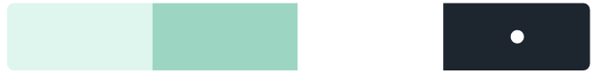
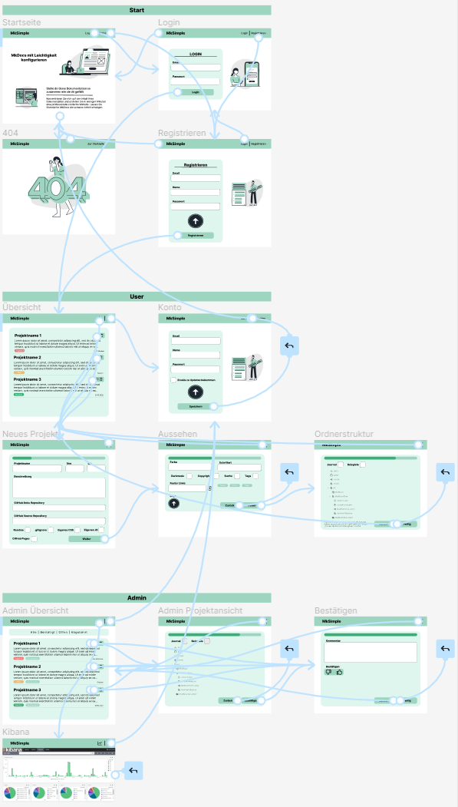

---
tags:
    - LB1
    - Konzept
hide:
    - toc
---

# Mockup

Ein Mockup ist eine grafische Darstellung eines **Benutzeroberfläche**. Es dient als Vorlage für die Entwicklung einer Software und bereits in der Planung auf Fehler deuten. Funktionalitäten und Designs können so bereits vor der Entwicklung getestet und visualisiert werden. Zu beachten ist, dass es nur ein Prototyp ist und die tatsächliche Umsetzung davon abweichen kann.

Die Mockups wurden mit [Figma](https://www.figma.com/) erstellt. Figma ist eine Webanwendung, die es ermöglicht, gemeinsam an einem Projekt zu arbeiten. Es ist kostenlos und auf allen Geräten benutzt werden. Die Mockups sind öffentlich und können [hier](https://www.figma.com/file/bm3B3SmrKILNZ37ZRtkQEe/M133?node-id=0%3A1) eingesehen werden. Die Mockups sind in drei Bereiche unterteilt: **Start**, **User** und **Admin**. Der Startbereich ist die Startseite der Website, auf welcher die Anmeldung passiert. Der Userbereich ist die Seite, die der User sieht, wenn er sich angemeldet hat. Dort kann er seine Vorlagen herunterladen und Neue erstellen. Der Adminbereich ist die Seite, die nur die Administratoren sehen. Dort können sie die Anträge der User bestätigen oder ablehnen.

Wenn die **Verbindungen** der einzelnen Seiten eingesehen werden möchte, dann kann dies durch das Umstellen auf den [Prototypen](https://www.figma.com/prototyping/)-Modus erreicht werden. Dieser Modus zeigt die Verbindungen zwischen den einzelnen Seiten an. Sie werden nur in diesem Modus angezeigt.

<iframe style="border: 1px solid rgba(0, 0, 0, 0.1);width:100%;height:700px;" src="//www.figma.com/embed?embed_host=share&url=https%3A%2F%2Fwww.figma.com%2Ffile%2Fbm3B3SmrKILNZ37ZRtkQEe%2FM133%3Fnode-id%3D0%253A1" allowfullscreen></iframe>

<small>
    Falls die Mockups nicht angezeigt werden, dann kann dies [hier](https://www.figma.com/file/bm3B3SmrKILNZ37ZRtkQEe/M133?node-id=0%3A1) eingesehen werden.  
    Die Illustrationen stammen von [niceillustrations.com](https://niceillustrations.com/free-illustrations/?_sft_styles=mint).
    Für die Icons wurden die Icons von [Octicons](https://primer.style/octicons/) verwendet.
</small>

## Farben

Als Farbpalette werden folgende vier Farben verwendet:

{loading=lazy}

## Verbindungen

{width=100% loading=lazy}
