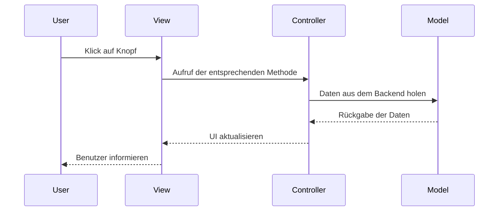

---
tags:
    - "Nicht zugeteilt"
---

# M133 - Model-View-Controller

MVC ist ein **Design-Pattern**, welches die Strukturierung von Anwendungen erleichtert. Es ist ein Ansatz, um die verschiedenen Komponenten einer Anwendung zu trennen. Das Ziel von [MVC](https://www.php-einfach.de/experte/objektorientierte-programmierung-oop/php-design-patterns/model-view-controller-in-php/) ist es, die einzelnen Komponenten des Programms voneinander zu **trennen**. Dadurch ist es möglich, dass die einzelnen Komponenten **unabhängig** voneinander entwickelt werden können. Es ist möglich, dass die View von einem anderen Programm verwendet wird, ohne dass das Model oder der Controller verwendet werden. Das Model kann auch von einem anderen Programm verwendet werden, ohne dass die View oder der Controller verwendet werden.

## Aufbau von MVC

Als **Einsteigspunkt** gilt bei MVC der Controller. Dieser ist für die Verarbeitung der Anfragen zuständig. Er ruft die entsprechenden Model-Methoden auf und gibt die Daten an die View weiter. Die View ist für die Darstellung der Daten zuständig. Sie ruft die entsprechenden Controller-Methoden auf, wenn der Benutzer auf einen Button klickt.

<small style="text-align: center; display:block;">[Link zu PlantUML](https://www.plantuml.com/plantuml/svg/POynJWD134NxdE9V81VO8Wg11aLfa49lThtiQ3sUoECH4cUZus8CfbY9jFPx_-iVgvDvoxAxLZRi3mUy9luOS9Oqhg0suwpbDky0n2UGnw9kHOHjm4ERhLDJjrcztep7XNLYnOLzAHE7kXaHSEbt6V14tZbgjUiP9nhNRc8fmXfMODZ_htpv_XhNTthZQ8sGkv9joVKPj7eZIJMniMvJ0lhTFU34slopYqddOlaFFB9EBSiF)</small>

### Model

Das Model ist die **Datenhaltung**. Hier werden die Daten gespeichert und verarbeitet. Es ist unabhängig von der View und dem Controller. Bei richtigem Design ist es möglich, dass das Model auch von anderen Programmen verwendet werden kann, ohne die View oder den Controller zu verwenden. Das Model enthält grundsätzlich keine Logik sondern nur die **Daten** und die **Methoden**, um auf die Daten zuzugreifen. Die Logik wird in den Controller ausgelagert. Meist spricht man dann auch von [POPO](https://stackoverflow.com/questions/41188002/what-does-the-term-plain-old-php-object-popo-exactly-mean) (Plain Old PHP Object), da es sich um eine sehr einfache PHP-Klasse handelt.

### View

Die View ist die **Benutzeroberfläche**. Hier werden die Daten angezeigt und der Benutzer kann mit dem Programm interagieren. Die View sendet Events an den Controller, wenn der Benutzer auf einen Button klickt. Alle Änderungen am UI werden vom Controller vorgenommen, da die View selbst keine Logik enthalten darf. Sie zeigt nur die Daten an und gibt **Events** weiter. Der Benutzer kann also nicht direkt auf das Model zugreifen. Die einzige Logik, die in der View enthalten sein darf, ist die Logik, die das UI verändert. Zum Beispiel, wenn ein Button angezeigt werden soll, wenn eine [Bedingung](../../PHP/Aufgaben/Vergleiche.md) erfüllt ist oder [Schleifen](../../PHP/Aufgaben/Schleifen.md).

### Controller

Der Controller ist die Verbindung zwischen Model und View. Er verarbeitet die **Benutzereingaben** und gibt diese an das Model weiter. Er holt sich die Daten aus dem Model und gibt sie an die View weiter. Der Controller ist somit die **Verbindung** zwischen den beiden unabhängigen Teilen.

Die schwierigste Aufgabe des Controllers ist, dass die View mit den Daten **synchron** ist, da der Benutzer immer den aktuellen Stand sehen möchte. Zudem darf er keine ungültigen Werte weiterleiten und muss die Daten **validieren**. Sicherheitstechnisch ist es sehr wichtig, dass hier die Validierung passiert, da der Benutzer die View bearbeiten kann.

## Beispiel

Das [Beispiel](https://github.com/bztfinformatik/lernportfolio-21r8390-php/tree/main/Aufgaben/004_MVC-Example) zeigt, wie ein einfaches **MVC-Programm** aufgebaut ist. Personen werden aus der Datenbank geholt und in einer Tabelle angezeigt. Über ein Suchfeld kann nach Personen gesucht werden. Das Projekt beinhaltet auch ein Beispiel wie der Code nicht aufgebaut sein sollte. Dieses Beispiel zeigt, wie die einzelnen Komponenten miteinander verknüpft sind.
