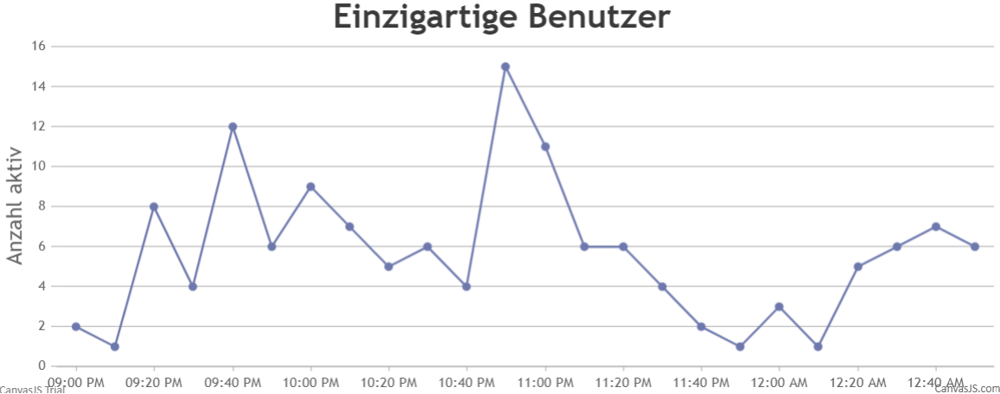

---
tags:
    - PHP
    - Sessions & Cookies
    - Beispiele
---

# Anwendung

In diesem Abschnitt wird beschrieben wir [Cookies](Cookies.md) und [Sessions](Sessions.md) in einer Anwendung verwendet werden können. Dazu wird ein kleines Beispielprogramm erstellt, welches die **Anzahl einzigartiger Besucher** einer Webseite zählt. Dies ist sozusagen das _Hello World_ des Session-Handlings und der Web analytics. Das [Endresultat](https://edu.flimtix.dev/M133-Aufgaben/BenutzerCounter/) kann live getestet werden. Der vollständige Quellcode ist wie immer auf [GitHub](https://github.com/bztfinformatik/lernportfolio-21r8390-php/tree/main/Aufgaben/009_Benutzer_Counter) zu finden.

## Aufbau

Das Programm besteht aus einer PHP-Datei, welche die Anzahl der Besucher zählt und in einer **JSON-Datei** speichert. Die JSON-Datei wird automatisch erstellt, wenn sie noch nicht existiert. Die Anzahl wird in der Datei gespeichert und bei jedem Aufruf der Seite, wenn die **Session** oder das **Cookie** noch nicht existiert, um eins erhöht.

```bash title="Dateistruktur"
├───docker-compose.yml
└───app
    ├───data.json
    └───index.php
```

Im JSON wird die **Uhrzeit** und die Anzahl der einzigartigen Benutzer angezeigt. Die Uhrzeit wird auf **10 Minuten** gerundet, damit die Anzahl der Besucher nicht zu oft aktualisiert wird. Zudem können so besser Auswertungen gemacht werden.

```json
{
	"2022-12-07 21:00:00": 2,
	"2022-12-07 21:10:00": 1,
	"2022-12-07 21:20:00": 8
}
```

## Programm

In der PHP-Datei wird zuerst eine [Session](Sessions.md) gestartet, da dies **vor allen anderen Ausgaben** gemacht werden muss. Danach wird überprüft, ob die Session und das Cookie gesetzt sind. Wenn dies nicht der Fall ist, wird die Session gesetzt und das [Cookie](Cookies.md) gespeichert. Das Cookie ist dafür zuständig, dass auch bei einer neuen Session der Benutzer wiedererkannt wird. Das Cookie wird für eine einzige Woche gespeichert. Danach wird die aktuelle Zeit geholt und auf **10 Minuten** gerundet. Als nächstes wird die **JSON-Datei** gelesen und in ein [assoziatives Array](../Aufgaben/Arrays.md) umgewandelt. Wenn die aktuelle Zeit bereits in der JSON-Datei ist, wird die Anzahl der Besucher um eins erhöht. Wenn dies nicht der Fall ist, wird die aktuelle Zeit mit der Anzahl 1 in das **Array** geschrieben. Danach wird das Array wieder in eine JSON-Datei umgewandelt und gespeichert.

```php
<?php
// Start the session (1)
session_start();

// Check if hasVisited is set in session and cookie
if (!isset($_SESSION['hasVisited']) && !isset($_COOKIE['hasVisited'])) {
    // Set hasVisited to true
    $_SESSION['hasVisited'] = true;

    // Save in cookie (2)
    setcookie('hasVisited', true, time() + 60 * 60 * 24 * 7);

    // Get the current date and round it to 10 minutes
    $time = round(time() / 600) * 600;

    // Convert the time to a date (3)
    $time = date('Y-m-d H:i:s', $time);

    // Check if the json file exists
    if (!file_exists('data.json')) {
        // Create the json file
        file_put_contents('data.json', '{}');
    }

    // Get the json
    $json = file_get_contents('data.json');

    // Decode the json
    $data = json_decode($json, true);

    // Check if the time is already in the json (4)
    if (isset($data[$time])) {
        // Add 1 to the time
        $data[$time]++;
    } else {
        // Set the time to 1
        $data[$time] = 1;
    }

    // Encode the json
    $json = json_encode($data);

    // Save the json
    file_put_contents('data.json', $json);
}
?>
```

1. Muss am **Anfang** der PHP-Datei gemacht werden, damit die [Session](Sessions.md) gestartet wird.
2. Auch wenn die **Session** beendet wird sollte der Benutzer **wiedererkannt** werden. Deshalb wird das [Cookie](Cookies.md) gespeichert.
3. Dieses Format ist wichtig, damit **JavaScript** das Datum richtig lesen kann.
4. Fügt die Anzahl der Besucher um eins hinzu, wenn die Zeit bereits in der **JSON-Datei** ist. Wenn dies nicht der Fall ist, wird die Zeit mit der Anzahl 1 in das **Array** geschrieben.

## Ausgabe

Solche schönen Daten sollten auch entsprechend angezeigt werden. Aus diesem Grund wird das JSON mithilfe von JavaScript ausgelesen und in ein **Diagramm** umgewandelt. Dafür wird [CanvasJS](https://canvasjs.com/) verwendet, was eine sehr einfache und schnelle Möglichkeit bietet, Diagramme zu erstellen. Für die Erstellung müssen nur die **X-** und **Y-Achse** angegeben werden. Die Daten werden automatisch ausgelesen und in das Diagramm eingefügt.

<figure markdown>
  { width=100% loading=lazy }
  <figcaption>Dieser Schritt ist optional und dient nur zur Schönheit</figcaption>
</figure>
