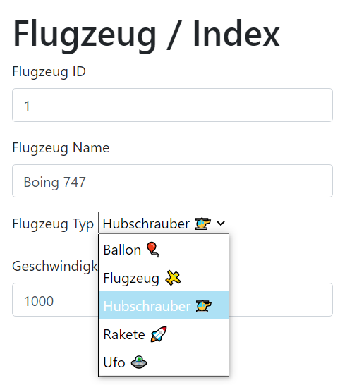

---
tags:
    - PHP
    - Twig
---

# Logik

-   Dropdown erklären
    -   Macros

Das **Hinzufügen** von neuen Dateien funktioniert genau gleich wie ohne Twig. Dieser Vorgang wurde bereits in einem [vorherigen Kapitel](../Framework/Hinzufügen.md) erläutert. Die Dateien werden in den entsprechenden Ordnern abgelegt und können über den Controller geladen werden. Im **Gegensatz** zum Framework muss Twig über eine [render Methode](https://twig.symfony.com/doc/3.x/api.html#rendering-templates) geladen werden. Der Aufruf davon sieht wie folgt aus:

=== "Render Methode"

    ```php
    <?php
    // Die Variable $twig ist vom Typ Twig_Environment (1)
    echo $this->twig->render('pfad/zu/view.twig.html', ['variablen' => 'werte']);
    ```

    1. Die Variable $twig wurde in der Base Klasse definiert und ist vom Typ [Twig_Environment](https://twig.symfony.com/doc/3.x/api.html#twig-loader-arrayloader). Der genaue Vorgang wurde in der [Installation](Installation.md#twig-laden) beschrieben.

=== "Controller"

    ```php
    <?php
    require_once '../app/models/FlugiTypen.php';

    class Flugzeug extends Controller
    {
        public function index($name = '')
        {
            // Flugzeug Model laden und befüllen
            $flugzeug = $this->model('Flugi');
            $flugzeug->id = 1;
            $flugzeug->name = "Boing 747";
            $flugzeug->speed = 1000;
            $flugzeug->typ = FlugiTypen::Ballon;

            // Typen laden (1)
            $typen = array_map(
                fn ($enumItem) => "{$enumItem->value}",
                FlugiTypen::cases()
            );

            // View laden
            echo $this->twig->render('flugzeug/index.twig.html', ['title' => "Flugzeug / Index", 'flugzeug' => $flugzeug, 'typen' => $typen]);
        }
    }
    ```

    1. Die Typen sind ein [Enum](https://stitcher.io/blog/php-enums) vom Typ `string`. Sie werden in ein [assoziatives Array](../Aufgaben/Arrays.md) umgewandelt, damit der Text und die Nummer getrennt sind.

## Formular

Ein Formular verhält sich **exakt gleich** wie im HTML. Der einzige Unterschied ist, dass die Werte der Felder über Twig eingefügt werden. So enthält die Datei kein PHP und nur gültiges HTML. Hier wird das Basislayout [überschrieben](Design.md#erweitern), welches den Block `content` enthält. So konnten alle Imports in einer einzigen Datei gesammelt werden.

=== "Formular"

    ```twig
    

    <!-- Wir überschreiben den Content-Block -->
    
    <h1 class="mt-5">{{ title }}</h1>
    <form>
        <div class="form-group">
            <label for="id">Flugzeug ID</label>
            <input type="text" class="form-control" id="id" name="id" value="{{ flugzeug.id }}">
        </div>
        <div class="form-group">
            <label for="name">Flugzeug Name</label>
            <input type="text" class="form-control" id="name" name="name" value="{{ flugzeug.name }}">
        </div>
        <div class="form-group">
            <label for="speed">Geschwindigkeit</label>
            <input type="number" class="form-control" id="speed" name="speed" value="{{ flugzeug.speed }}">
        </div>
    </form>
    
    ```

=== "Resultat"

    { loading=lazy }

## Dropdown

Ein Dropdown mit **dynamischem Inhalt** ist über HTML nicht möglich. Mithilfe von Twig kann dies jedoch mit Leichtigkeit ermöglicht werden. Dazu wird am besten ein [Macro](https://twig.symfony.com/doc/3.x/tags/macro.html) erstellt, damit das Dropdown wiederverwendbar ist. Hier wird der Name des Dropdowns und die Optionen übergeben. Die Optionen werden in einer [Schleife](Design.md#for) durchlaufen und die **aktuelle Option** wird mit dem Wert verglichen. Ist dies der Fall, wird das Attribut `selected` gesetzt. Dieses Attribut ist für das Dropdown notwendig, damit die Option bereits ausgewählt ist.

=== "Makro"

    ```twig
    
    <select name="{{ name }}">
        
        <option value="{{ key }}"  selected >{{ value }}</option>
        
    </select>
    
    ```

=== "Resultat"

    !!! success ""

        <div class="form-group">
            <label for="typ">Flugzeug Typ</label>
            <select name="typ">
                <option value="0">Ballon 🎈</option>
                <option value="1">Flugzeug 🛩</option>
                <option value="2">Hubschrauber 🚁</option>
                <option value="3">Rakete 🚀</option>
                <option value="4">Ufo 🛸</option>
            </select>
        </div>

Damit das **Makro** verfügbar ist muss es auch in der View geladen werden. Dies geschieht mit dem [import](Design.md#einbinden) Befehl. Nun kann das Makro wie eine normale Funktion aufgerufen werden. Das daraus generierte HTML wird dann in die View eingefügt.

```twig title="Dropdown verwenden"

{{ dHelper.dropdown('typ', typen, flugzeug.typ) }}
```
